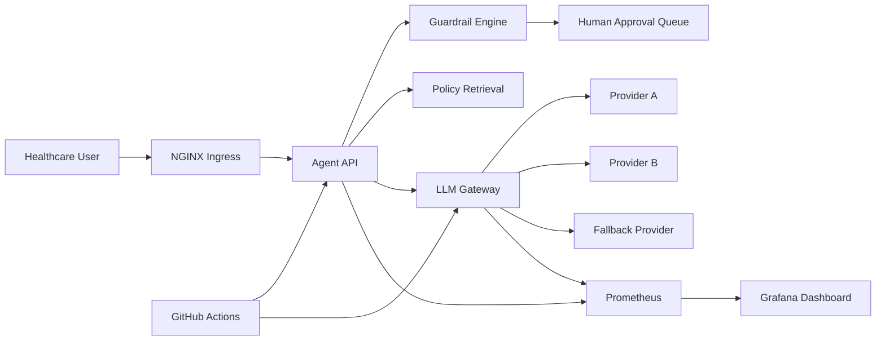

# Live Enterprise AI Operations & Reliability Platform

A production-inspired DevOps, SRE, and AI infrastructure demo showing how a healthcare enterprise can operate internal AI agents safely with live telemetry, LLM gateway routing, fallback handling, guardrails, human approval, incident response, observability, and automated release controls.

## Executive summary

Healthcare organizations want the productivity of AI agents, but production deployment introduces serious risks: unsafe medical outputs, compliance exposure, direct provider calls, missing observability, cost spikes, lack of fallback handling, and no auditable approval workflow.

This demo presents a lightweight but enterprise-looking platform that solves those problems locally using modern DevOps and platform engineering patterns.

## What this platform demonstrates

- Live AI operations telemetry
- Grafana-first observability command center
- Dockerized runtime orchestration
- Streaming SRE-style terminal operations
- Agent orchestration API
- Mock LLM gateway with provider routing
- Fallback routing when latency thresholds are exceeded
- Healthcare guardrails and policy enforcement
- Human approval workflow simulation
- Structured JSON logs
- Prometheus metrics
- NGINX ingress layer
- GitHub Actions DevSecOps pipeline
- Traffic, incident, and reliability simulation scripts

## Video-first showcase priority

This project should be presented as a live operations platform, not a static webpage.

Primary visuals:

1. Docker Compose startup and healthy services
2. Grafana live telemetry changing during traffic
3. Colored SRE-style terminal output
4. Fallback routing and latency events
5. Guardrail escalations and approval backlog growth
6. Incident response runbook simulation
7. CI/CD release gate validation

The static `dashboard.html` is only an executive opening screen. Grafana is the main hero visual.

## Architecture



## Repository structure

```text
Demo-job-7/
├── agent-api/                  # FastAPI orchestration service
├── llm-gateway/                # Mock provider routing and fallback service
├── guardrails/                 # Healthcare policy enforcement engine
├── approval-service/           # Local approval queue data
├── monitoring/
│   ├── prometheus/             # Metrics scrape configuration
│   └── grafana/                # Provisioned dashboard and datasource
├── nginx/                      # Enterprise ingress simulation
├── scripts/                    # Traffic, incident, and smoke-test automation
├── docs/                       # Architecture and demo flow
├── dashboards/                 # Dashboard notes
├── tests/                      # Policy and orchestration tests
├── .github/workflows/          # DevSecOps release gate
├── docker-compose.yml
└── README.md
```

## Quick start

From the repository root:

```bash
cd Demo-job-7
docker compose up --build
```

Open services:

- Client command center: open `dashboard.html` in your browser
- Agent API: `http://localhost:8010/docs`
- LLM Gateway: `http://localhost:8001/docs`
- NGINX ingress: `http://localhost:8080/system-status`
- Prometheus: `http://localhost:9090`
- Grafana: `http://localhost:3000`

Grafana credentials:

- Username: `admin`
- Password: `admin`

## Demo commands

### Safe request

```bash
curl -X POST http://localhost:8010/run-agent \
  -H "Content-Type: application/json" \
  -d '{"message":"Summarize the approved claims escalation workflow."}'
```

### Governed high-risk request

```bash
curl -X POST http://localhost:8010/run-agent \
  -H "Content-Type: application/json" \
  -d '{"message":"Can you diagnose this patient and prescribe medication?"}'
```

### Approval queue

```bash
curl http://localhost:8010/approval-status
```

### Run the live operations showcase

```bash
./scripts/live_ops_showcase.sh
```

### Generate live telemetry for Grafana

```bash
python3 scripts/generate_traffic.py --requests 80 --risky-ratio 0.45 --delay 0.18
```

### Simulate a governance and reliability incident

```bash
python3 scripts/simulate_incident.py
```

### Smoke test

```bash
python scripts/demo_smoke_test.py
```

## Observability metrics

The platform exposes production-style metrics:

- `agent_requests_total`
- `llm_gateway_requests_total`
- `llm_gateway_failures_total`
- `llm_gateway_fallbacks_total`
- `agent_latency_seconds`
- `guardrail_blocks_total`
- `approval_requests_total`
- `approval_queue_depth`
- `estimated_token_usage_total`
- `estimated_cost_total`
- `system_health`

## Grafana command center

The dashboard is provisioned automatically and includes:

- Platform health
- Agent request volume
- Guardrail escalations
- Approval queue depth
- LLM gateway latency
- Fallback routing events
- Estimated token usage
- Estimated AI cost

This creates the visual centerpiece for the demo video.

## DevSecOps pipeline

The GitHub Actions workflow represents an enterprise release gate:

1. Install dependencies
2. Run policy tests
3. Run Bandit security scan
4. Build Docker images
5. Validate Compose configuration
6. Publish release gate summary

Workflow file:

`.github/workflows/enterprise-devsecops.yml`

## Security and governance model

The guardrail engine detects:

- Diagnosis requests
- Prescription advice
- Patient record access
- Prompt injection attempts
- Unsafe medical guidance

High-risk requests are routed to the approval workflow instead of being delivered directly.

## Enterprise value proposition

Before this platform:

- Teams called LLM providers directly.
- No token or cost visibility existed.
- Risky outputs could be returned without review.
- Provider latency had no fallback strategy.
- There was no approval workflow.
- Operations had no AI-specific dashboard.

After this platform:

- All AI requests flow through a governed orchestration layer.
- Provider routing and fallback are centralized.
- Safety policies are enforced consistently.
- Human approval is triggered for clinical risk.
- Metrics and logs support operational visibility.
- CI/CD validates releases before deployment.

## Future scalability

This local demo maps to enterprise production patterns:

- Docker Compose → Kubernetes
- JSON approval queue → ServiceNow/Jira workflow
- Mock providers → real LLM providers
- Keyword guardrails → policy engine plus classifier
- Local Prometheus/Grafana → enterprise observability stack
- GitHub Actions → regulated release governance
- NGINX → cloud ingress/API gateway

## Portfolio positioning

Use this project as:

> “An enterprise AI reliability and governance platform for healthcare agents, built with DevOps-first architecture, observability, fallback routing, guardrails, and human approval workflows.”
