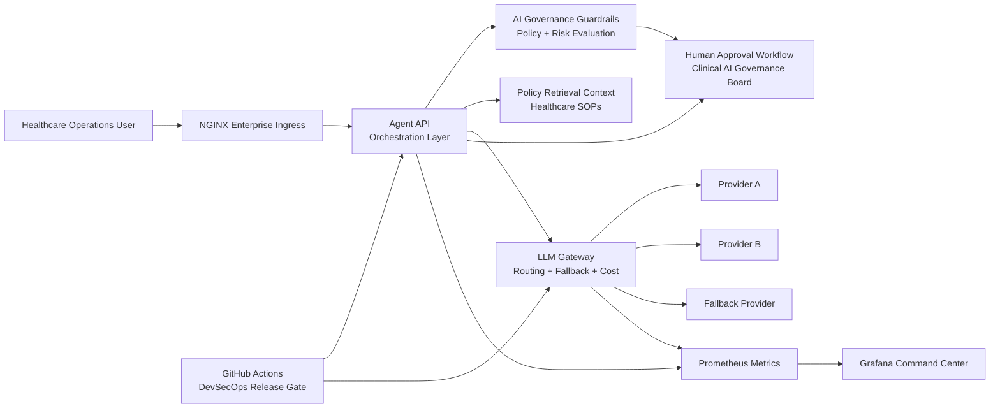

# Architecture: Enterprise Healthcare AI Agent Governance Platform

## Client scenario

Healthcare enterprises want to deploy internal AI agents, but direct model access creates reliability, safety, compliance, and cost-control risks. This platform introduces a governed AI infrastructure layer that routes every request through orchestration, policy enforcement, provider routing, observability, and approval workflows.

## Architecture diagram

## Runtime flow

1. User submits an AI request to the Agent API.
2. Agent API assigns a request ID and emits structured JSON logs.
3. Guardrails evaluate healthcare safety, PHI risk, diagnosis risk, prescription risk, and prompt injection attempts.
4. Retrieval selects approved policy context.
5. LLM Gateway routes to a mock provider and calculates latency, tokens, and cost.
6. If provider latency crosses threshold, the gateway routes to the fallback provider.
7. High-risk requests are placed into the human approval queue.
8. Prometheus scrapes service and gateway metrics.
9. Grafana visualizes system health, latency, traffic, fallback routing, approvals, cost, and guardrail activity.

## DevOps controls

- Dockerized services
- Docker Compose local platform
- NGINX ingress routing
- Health checks
- Prometheus metrics
- Grafana dashboards
- GitHub Actions release gate
- pytest validation
- Bandit security scanning
- Structured JSON logs
- Smoke test script

## Production mapping

This local demo maps cleanly to enterprise infrastructure:

- Docker Compose → Kubernetes or ECS
- Local JSON approval queue → workflow engine or ticketing system
- Mock gateway providers → real model providers
- Keyword guardrails → policy engine and LLM safety classifier
- Local Prometheus/Grafana → enterprise observability stack
- GitHub Actions → production CI/CD release governance
